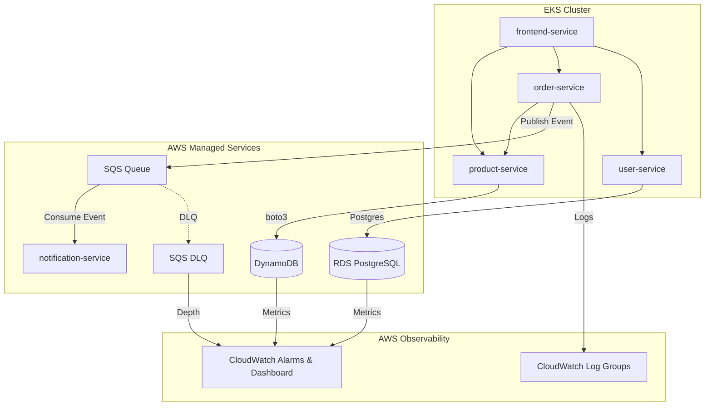

# CloudMart — AWS & Kubernetes Deployment Guide

This guide describes how to deploy the full CloudMart infrastructure (networking, databases, messaging, observability) and Kubernetes microservices using the modular Terraform setup.

---

## Deployment Architecture



---

## Repository Structure

```
infra/
├── bootstrap/                  # S3 backend + DynamoDB lock table
├── environments/
│   ├── staging/                # Staging root module
│   │   ├── backend.tf
│   │   ├── main.tf             # Calls networking, database, messaging, observability modules
│   │   ├── variables.tf
│   │   ├── outputs.tf
│   │   └── terraform.tfvars.example
│   └── production/             # Production root module
│       ├── backend.tf
│       ├── main.tf
│       ├── variables.tf
│       ├── outputs.tf
│       └── terraform.tfvars.example
└── modules/
    ├── networking/             # VPC, subnets, NAT, security groups
    ├── database/               # RDS PostgreSQL, DynamoDB
    ├── messaging/              # SQS queue + DLQ
    ├── observability/          # CloudWatch log groups, alarms, dashboard
    ├── ecr/                    # ECR repositories
    └── eks/                    # EKS cluster, hardened nodes, OIDC and audit logs
```

---

## Phase 0: Bootstrap Remote Backend (One-time)

> [!NOTE]
> Only run this once per AWS account. It provisions the S3 bucket and DynamoDB table for Terraform state.

```bash
cd infra/bootstrap
terraform init
terraform apply
```

---

## Phase 1: Deploy Infrastructure (Staging or Production)

Navigate to the desired environment and deploy all modules at once:

### 1. Initialize and Apply Terraform

```bash
cd infra/environments/staging    # or infra/environments/production
terraform init
terraform plan
terraform apply
```

> [!NOTE]
> The database master password (`db_password`) is configured to auto-generate using the `random` provider. You do not need to manually specify it during deployment.

### 2. Capture the Outputs

Once the apply completes, Terraform will output several variables. Take note of these:
* **`rds_endpoint`**: Connection endpoint for PostgreSQL (e.g. `cloudmart-users-db-staging.c3xxxxxx.us-east-1.rds.amazonaws.com:5432`)
* **`db_password`**: To retrieve the generated password, run:
  ```bash
  terraform output -raw db_password
  ```
* **`dynamodb_table_name`**: Name of the DynamoDB table (e.g. `cloudmart-products-staging`)
* **`sqs_queue_url`**: Queue URL for order events
* **`rds_instance_identifier`**: RDS ID for monitoring
* **`sqs_dlq_name`**: Dead Letter Queue name for monitoring

---

## Phase 2: Kubernetes Configuration

Now update the Kubernetes ConfigMap and Secret with the outputs captured above.

### 1. Update ConfigMap (`k8s/configmap.yaml`)

Ensure the backends are set to use the cloud adapters:
```yaml
apiVersion: v1
kind: ConfigMap
metadata:
  name: cloudmart-config
  namespace: cloudmart-prod
data:
  PRODUCT_STORE_BACKEND: "dynamodb"
  DYNAMODB_TABLE: "cloudmart-products-staging"  # Replace with output
  ORDER_QUEUE_BACKEND: "sqs"
  NOTIFICATION_QUEUE_BACKEND: "sqs"
  USER_DB_BACKEND: "postgres"
  DB_PORT: "5432"
  DB_NAME: "cloudmart"
  DB_SSLMODE: "require"
  AWS_REGION: "us-east-1"
```

### 2. Install the Secrets Store CSI Driver

Sensitive values are stored in AWS Secrets Manager by Terraform. Do not create or commit a
plaintext Kubernetes Secret. Install the CSI driver and AWS provider as documented in
`docs/security/NETWORKING_AND_SECURITY.md`; the CI/CD workflow also performs this installation.

Apply the environment service accounts and SecretProviderClass after replacing their template
values, or allow the CI/CD workflow to render them automatically.

### 3. Deploy Kubernetes Resources

Apply the Kubernetes descriptors to your EKS cluster:
```bash
kubectl apply -f k8s/namespace.yaml
kubectl apply -f k8s/configmap-prod.yaml
kubectl apply -f k8s/security/network-policy-default-deny.yaml
kubectl apply -f k8s/security/network-policies.yaml
kubectl apply -f k8s/user-service.yaml
kubectl apply -f k8s/product-service.yaml
kubectl apply -f k8s/order-service.yaml
kubectl apply -f k8s/notification-service.yaml
kubectl apply -f k8s/frontend.yaml
```

---

## Phase 3: Observability

The observability stack (CloudWatch Log Groups, alarms, and dashboard) is now deployed **automatically** as part of Phase 1 via the `observability` module. No separate Terraform apply is needed.

Once the Phase 1 deployment is complete, navigate to **CloudWatch > Dashboards** in the AWS Console to view the **`CloudMart-Overview-<environment>`** dashboard.

---

## Verification & Testing

Verify that services are connected to AWS:

| Service | Test Action | Expected Result | Verification Check |
|---|---|---|---|
| **user-service** | Register a new user | Response code `201 Created` | Check RDS Postgres table `users` contains the record. |
| **product-service** | List products | Response code `200 OK` | Check DynamoDB table contains products. |
| **order-service** | Create a new order | Response code `201 Created` | Check SQS queue receives a message. |
| **notification-service**| Check console logs | Consumes SQS message | Verify log prints `Successfully processed and deleted message`. |
| **CloudWatch** | View Dashboard | Dashboard loads graphs | Active CPU and database connections show up. |

---

> [!WARNING]
> Ensure that only one team member runs `terraform apply` per environment to avoid duplicate resources and naming conflicts.
